<p align="center">
  <picture>
    <source media="(prefers-color-scheme: dark)" srcset="docs/assets/logo-dark.svg">
    
  </picture>
</p>

<p align="center"><strong>Selective privacy for onchain finance</strong></p>

<p align="center">
  Sotto is a confidential business account on Solana: a company pays payroll, suppliers and payouts in stablecoins,<br>
  the amounts are encrypted onchain, and the company decides who can read which numbers.
</p>

<p align="center">
  <a href="LICENSE"></a>
  <a href="https://github.com/anilkaracay/sotto/actions/workflows/ci.yml"></a>
  <a href="https://explorer.solana.com/address/A7pejhdwBy4a2VtzmCpWiL1jVymiWEn42NZoDwMTQRhG?cluster=devnet"></a>
  <a href="https://sottoapp.xyz"></a>
</p>

## Demo

<p align="center">
  <a href="https://youtu.be/JuFm1sN6jMg">
    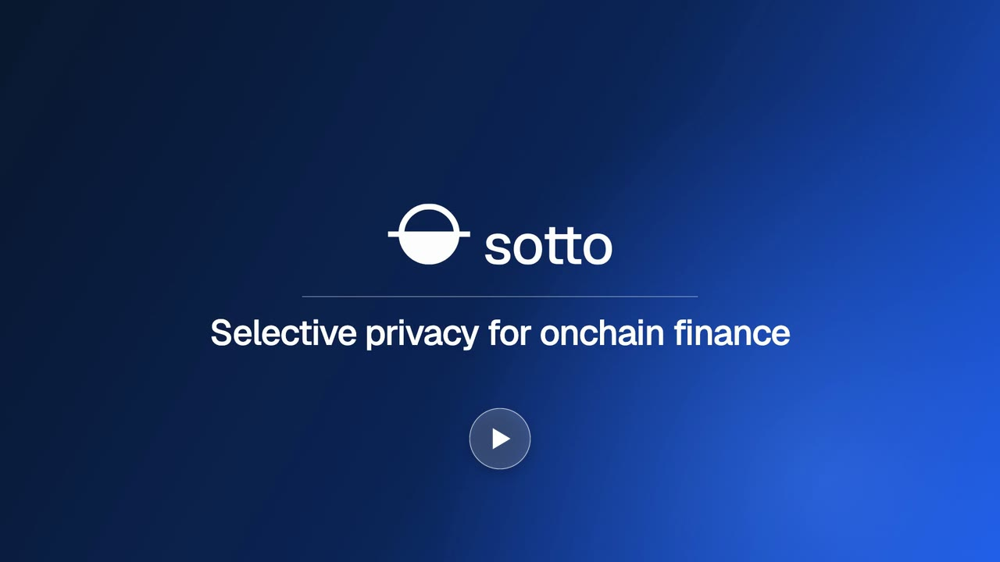
  </a>
</p>

<p align="center">
  <a href="https://sottoapp.xyz">sottoapp.xyz</a> ·
  <a href="https://sottoapp.xyz/v/7ssfLgVmvaC4zAFm9aVBw4jrJdb9mSisCKQXvFHjUbEX">A live proof of funds</a> ·
  <a href="https://docsend.com/view/qpvuwf336whbtsti">Pitch deck</a>
</p>

## Why

- Every payment on a public chain shows its amount.
- So anyone can read what a company pays its suppliers, what it pays its people and how long its money will last.
- Sotto keeps the amounts sealed onchain and leaves the choice of who reads them to the company.

## What

Three modules, one account.

### 01 · Confidential accounts

Balances and payment amounts are encrypted onchain with Token-2022 Confidential Balances. The company funds its account, pays a supplier or runs a payroll, and only it can read its own numbers. Who paid whom, and in which token, stays public.

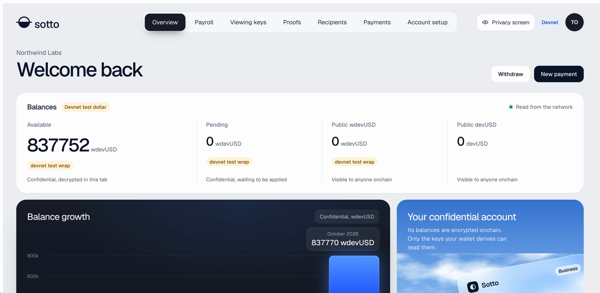

### 02 · Selective disclosure

The company grants a viewing key with a scope: every amount, one period, payroll only, or a person's own payslips. The records in scope are encrypted to that reader's own key, a grant can be revoked, and grants, shares, revocations and exports are recorded in the access log.

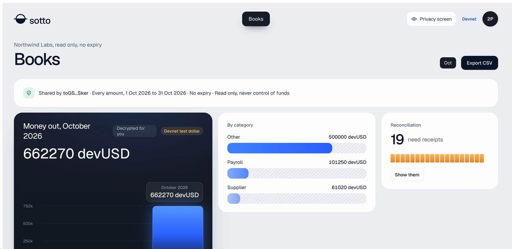

### 03 · Verifiable proofs

The company proves that its balance is at least a threshold. The proof is made in the browser, checked onchain by the `sotto_proofs` program with the ZK ElGamal proof program, and written as a record anyone can open. The balance itself is never disclosed.

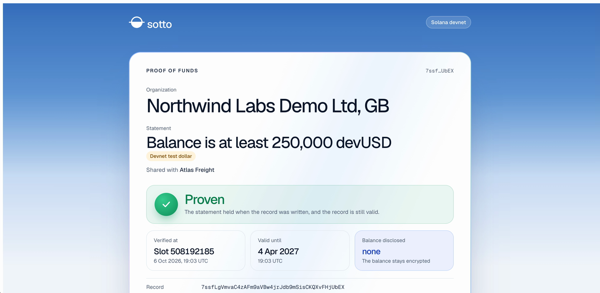

## How it works

<picture>
  <source media="(prefers-color-scheme: dark)" srcset="docs/assets/architecture-dark.png">
  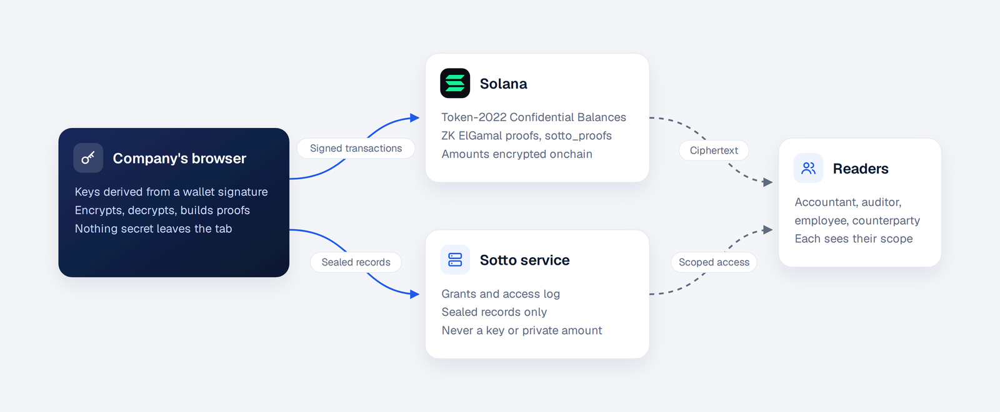
</picture>

- **The company's browser** derives the keys from a wallet signature. It encrypts, decrypts and builds the proofs. Nothing secret leaves the tab.
- **Solana** holds the money: Token-2022 Confidential Balances, the ZK ElGamal proof program and `sotto_proofs`. Amounts are encrypted onchain. Every token movement is an instruction signed by the user's wallet; `sotto_proofs` never moves tokens.
- **The Sotto service** holds the grants, the access log and sealed records only. It never holds a secret key or a private amount.
- **Readers** (an accountant, an auditor, an employee, a counterparty) each see their scope, and nothing else.

The details are in [`docs/04-ARCHITECTURE.md`](docs/04-ARCHITECTURE.md), [`docs/06-CONFIDENTIAL-FLOWS.md`](docs/06-CONFIDENTIAL-FLOWS.md) and [`docs/07-SELECTIVE-DISCLOSURE.md`](docs/07-SELECTIVE-DISCLOSURE.md).

## Try it

Sotto runs on Solana devnet with test money. There are two ways in.

**1. Explore the demo company, with no wallet:** https://sottoapp.xyz/demo
Pick a role, Owner (Elif), Accountant (Daniel), Employee (Maya) or Outsider, and see what that person reads of the same payments, or compare one payment across all four. It is read only: the records are opened in your browser with that role's demo viewing key, and nothing there can sign, pay or change anything.

**2. Quick start, with a wallet:** https://sottoapp.xyz/app
Connect Phantom or Solflare on Solana devnet and sign in. A new wallet gets a company at once, "My company", with no form, and lands on its dashboard. The checklist "Get ready to pay" there takes the wallet to its first payment in six steps, one button each: test SOL for fees, the confidential account, the public viewing key, 1,000,000 devUSD, moving 100,000 of it into the confidential balance, and applying it. Then "Pay Atlas Freight" opens the pay form with a demo recipient chosen.

A live proof of funds, for anyone: https://sottoapp.xyz/v/7ssfLgVmvaC4zAFm9aVBw4jrJdb9mSisCKQXvFHjUbEX
It states that Northwind Labs Demo Ltd holds at least 250,000 devUSD. Status: Proven, valid until 4 April 2027. Balance disclosed: none.

Pitch deck: https://docsend.com/view/qpvuwf336whbtsti

Every step with a picture is in the [Walkthrough](#walkthrough) below. The same in detail, with your own account:

1. Use Phantom or Solflare on Solana devnet. A new wallet needs no SOL to start: signing in costs nothing, and the faucet gives it devnet SOL for fees and account rent.
2. Sign in at https://sottoapp.xyz/app by signing a message with your wallet.
3. Your company exists at once, named "My company". On devnet Sotto verifies a new organization without reviewing it, so money features are on straight away, and issues an attestation onchain to your wallet whose level says that no review took place. Change its name, country and other details on its page whenever you like; the attestation is issued again when the name or the country changes.
4. On the dashboard, follow "Get ready to pay": devnet SOL from the faucet (0.05 SOL per wallet every 24 hours, while the wallet holds less than 0.02 SOL), your confidential account, your public viewing key, devUSD from the faucet (at most 1,000,000 devUSD per wallet every 24 hours), then move an amount into your confidential balance and apply it. Each of these is also on Account setup.
5. A company made by quick start already has one recipient, "Atlas Freight (demo recipient)", a demo wallet that can receive confidential payments, so you can pay at once on Payments. For your own recipients: on Recipients, add a recipient and send them the invite link. They sign in with their own wallet, register a viewing key and set up their account; the same page gives their wallet the devnet SOL that needs. Then pay them on Payments, or pay many people at once on Payroll.
6. On Viewing keys, invite a reader with a scope. They sign in and accept with their viewing key, and you share the past records their scope covers.
7. On Proofs, choose a threshold and who the answer is for. Your browser makes the proof, your wallet signs, and you get a public link anyone can open.

## Walkthrough

From sign in to a first confidential payment, its check on the explorer and a proof of funds: six steps on Solana devnet, with the labels the live screens show and a picture of each. The same page is in the app: https://sottoapp.xyz/app/walkthrough. You need Phantom or Solflare and nothing else; Sotto sends the test SOL and the test dollars, which have no value.

**1. Switch your wallet to devnet.** A new, empty account is enough.

- Phantom (checked with 26.31.0): open the account menu at the top left, then the gear, then **Developer Settings**, and turn on **Testnet Mode**. Phantom goes back to its home screen and shows **You are currently in Testnet Mode**. **Solana Devnet** is selected already: it is ticked under Developer Settings, as in the picture.
- Solflare (checked with 2.39.1): open the gear, then **General**. Under **Network** choose **Devnet**, and in the dialog **Switching to Devnet** choose **Continue**.

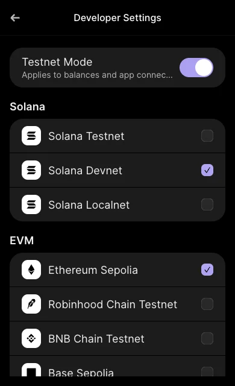 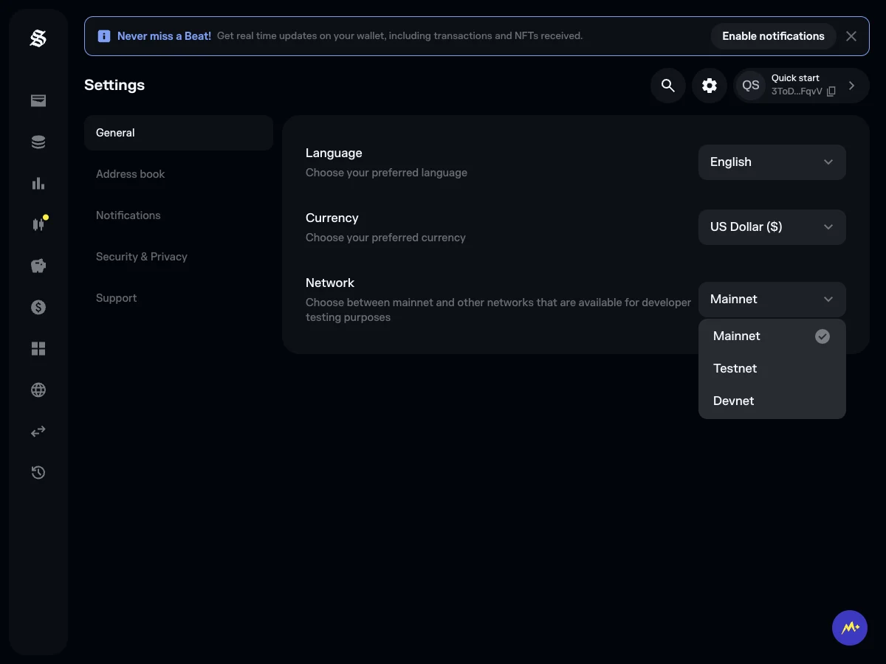

**2. Quick start: sign in.** Open https://sottoapp.xyz/app, or choose **Quick start** on the home page. Next to your wallet choose **Connect** and approve the connection, then **Sign in** and approve the message. Signing in sends no transaction and costs nothing. There is no form: your company, named My company, is there at once and you land on its dashboard.

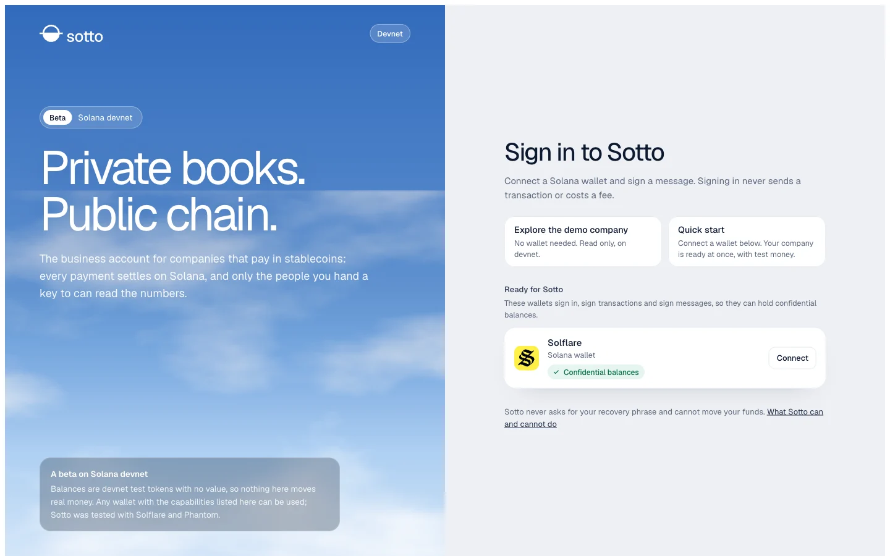

**3. Get ready to pay.** The dashboard opens with the checklist **Get ready to pay**. It has six steps, one in turn at a time, each with one button and a line that says what your wallet will ask before it opens. Nothing is signed until you choose a step's button.

1. **Get test SOL**: Sotto sends your wallet 0.05 SOL for fees. No wallet window.
2. **Unlock my keys and set up the account**: your wallet opens four windows, three messages that make and check your keys in this browser tab and one transaction that sets your confidential account up.
3. **Register public viewing key**: one message. Payment records are sealed to this key, so you can read your own records and nobody else can.
4. **Get 1,000,000 devUSD**: Sotto mints test dollars to your wallet. No wallet window.
5. **Move 100,000 devUSD**: one transaction that wraps the devUSD and deposits it into your confidential balance. You can change the amount first; it is public onchain, the balance it joins is not.
6. **Apply pending balance**: one transaction that makes the deposit available to spend.

Each finished step that happened onchain has its **Verify on Solana** link (registering the viewing key is a signed message, not a transaction). The same checklist is pinned at the top of Payments, Payroll and Proofs until it is complete. Then the dashboard says **Ready. Make your first confidential payment**, with the button **Pay Atlas Freight**.

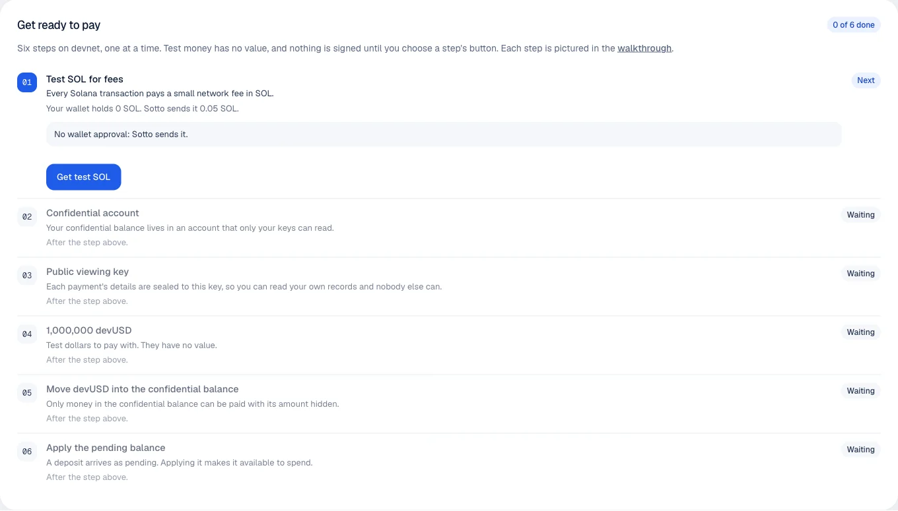

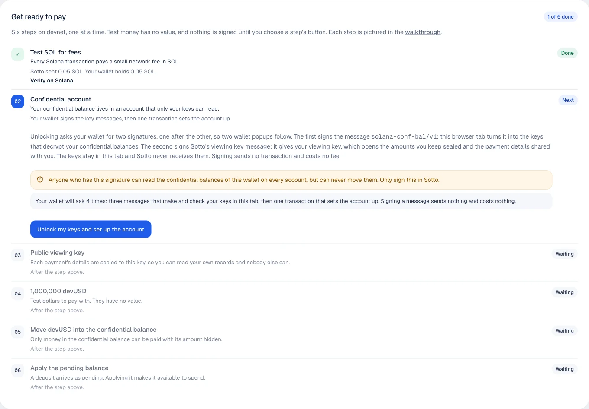

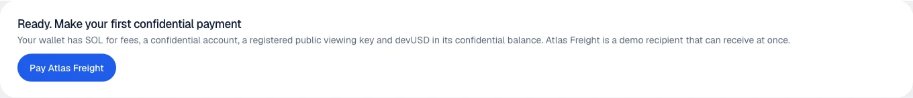

**4. Pay Atlas Freight.** **Pay Atlas Freight** opens **Payments** with the card **Pay a recipient** and, under **Recipient**, **Atlas Freight (demo recipient)** chosen already: a company made by quick start has this demo recipient from the start, a demo wallet whose account can receive confidential payments. Type an amount under **Amount (devUSD)**, for example 1250.50, a **Memo** if you like, and choose **Pay**. Solflare then asks for one transaction and then one message; Phantom asks for five transactions and then one message, as it signs the payment as five smaller transactions. If something stops the payment, the card says what happened and why, with a button that fixes it in place: too little in the confidential balance, too little SOL, a signature your wallet refused. Your form keeps what you typed.

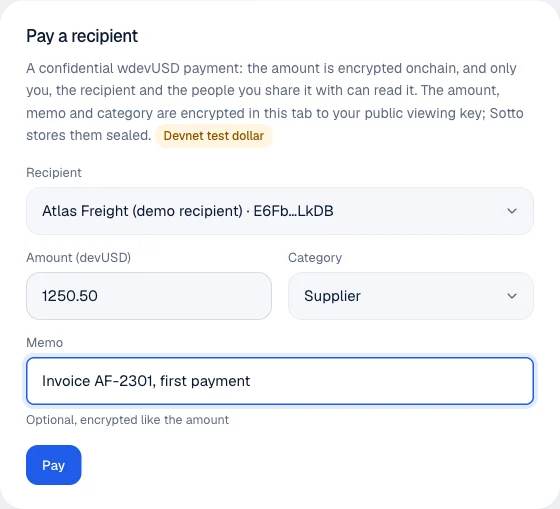

**5. Check on the explorer that the amount is hidden.** Under **Recent payments**, the column **Transaction** holds the payment's link to the Solana explorer. Open it. The explorer shows the instruction Token-2022 Program: Confidential Transfer with its source, destination and mint, and no amount: the number you typed is on Sotto's page and nowhere on the explorer.

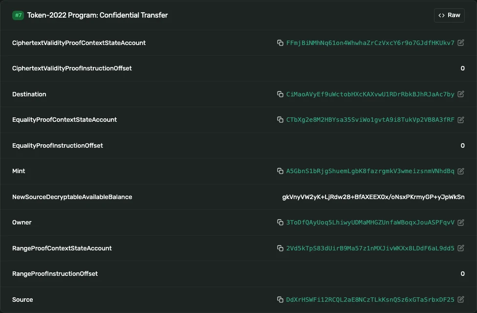

**6. Prove a balance without showing it.** Open **Proofs**. In the card **New proof**, under **Balance is at least** choose **Custom** and type an amount your balance covers, for example 50000. Under **Share the answer with** type who the answer is for, then choose **Generate proof**. Your wallet asks for five transactions. The result says Proven, and **Open the public page** opens a page anyone can read without a wallet: it states that the balance is at least the amount, and discloses no balance.

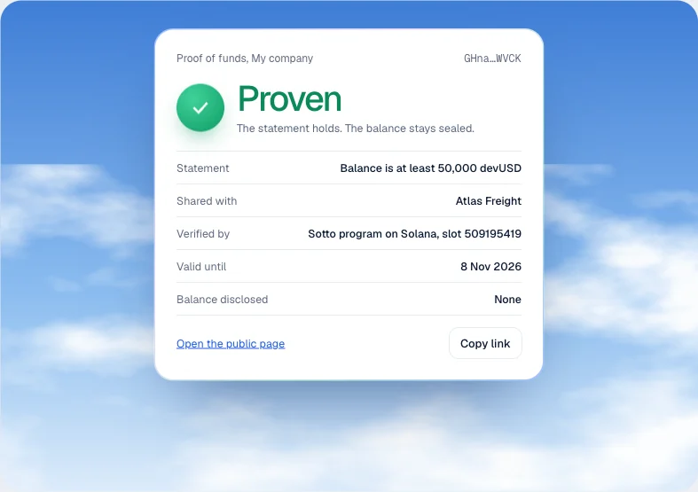

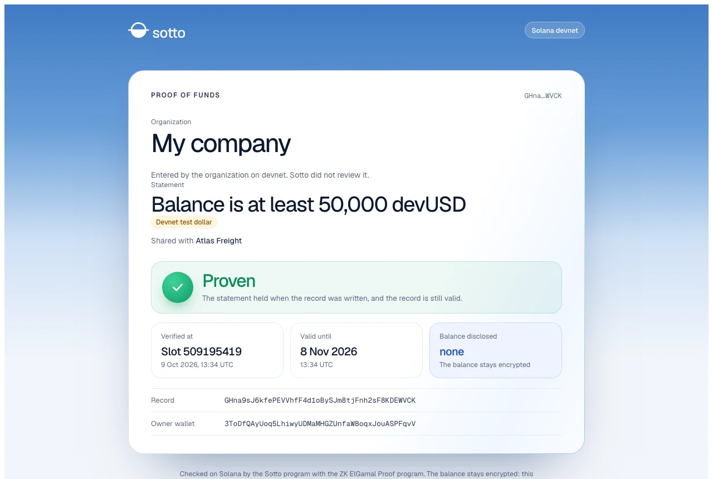

## Verify it

- A payment on the explorer shows the sender, the recipient and the token, but not the amount: https://explorer.solana.com/tx/4y8odT3AYxoZvcW5Xnbf6DMMNA3pcdHhqQVGJVffiTEkVEgq6Gc4vwGYeEmf8vMNeXCibxhnWqiuzTJUHanKTqD3?cluster=devnet
- The proof record is checked onchain by the sotto_proofs program with the ZK ElGamal proof program: https://explorer.solana.com/address/7ssfLgVmvaC4zAFm9aVBw4jrJdb9mSisCKQXvFHjUbEX?cluster=devnet
- A reader decrypts only what their grant covers. Grants, shares, revocations, payments, payroll runs, exports and proofs are recorded in the access log, and every viewing key shows when it was last used.
- No secret key and no private amount reaches Sotto's servers. They store public keys, and only amounts that are already public onchain, such as deposits and withdrawals.

Devnet addresses:

- sotto_proofs (USDC): [4rMKgJWgawaTTdUxaudUXthEExnRZ7AvFvqzsoEAr9jd](https://explorer.solana.com/address/4rMKgJWgawaTTdUxaudUXthEExnRZ7AvFvqzsoEAr9jd?cluster=devnet)
- sotto_proofs (devUSD): [A7pejhdwBy4a2VtzmCpWiL1jVymiWEn42NZoDwMTQRhG](https://explorer.solana.com/address/A7pejhdwBy4a2VtzmCpWiL1jVymiWEn42NZoDwMTQRhG?cluster=devnet)
- Wrapped USDC mint: [AhJfP4JJBaHWRtXRiaScZUC7SMm4RqUPSb3g9H5RT8Bd](https://explorer.solana.com/address/AhJfP4JJBaHWRtXRiaScZUC7SMm4RqUPSb3g9H5RT8Bd?cluster=devnet)
- devUSD mint: [KttR31BxvWErtewYs1uNiywFWwi3nwxUToixi5A2Akx](https://explorer.solana.com/address/KttR31BxvWErtewYs1uNiywFWwi3nwxUToixi5A2Akx?cluster=devnet)
- SAS credential: [4KX4P7he62x5x8X35vubNNhJRhV4vJXPGNsc8skPyKFT](https://explorer.solana.com/address/4KX4P7he62x5x8X35vubNNhJRhV4vJXPGNsc8skPyKFT?cluster=devnet)

## Run it locally

Prerequisites, pinned in [`docs/VERSIONS.md`](docs/VERSIONS.md): Node.js 24.21.0, pnpm 12.6.0, Rust 1.98.1, the Agave CLI suite 4.2.2 (with `cargo-build-sbf` 4.1.0) and Docker.

```sh
pnpm install --frozen-lockfile
```

**Configuration.** Every app reads its settings from its own git ignored file: `apps/web/.env.local`, `apps/worker/.env.local` and `packages/db/.env.local`. The names are in [`.env.example`](.env.example); no value belongs in the repository.

| Used by        | Names                                                                                                                                                                                                          |
| -------------- | -------------------------------------------------------------------------------------------------------------------------------------------------------------------------------------------------------------- |
| Web            | `NEXT_PUBLIC_CLUSTER`, `NEXT_PUBLIC_APP_URL`, `RPC_URL`, `DATABASE_URL`, `SESSION_SECRET` (at least 32 characters); optional: `SCREENING_PROVIDER`, `SCREENING_API_KEY`, `RESEND_API_KEY`, `DEMO_COMPANY_FILE` |
| Worker         | `RPC_URL`, `DATABASE_URL`, `SAS_SIGNER_KEYPAIR`, `SAS_CREDENTIAL_ADDRESS`, `SAS_SCHEMA_ADDRESS`; optional: `SOTTO_NOTIFY_URL`, `SOL_FAUCET_KEYPAIR`                                                            |
| Database tools | `DATABASE_URL`; optional: `ADMIN_WALLETS`                                                                                                                                                                      |

For a local validator, `NEXT_PUBLIC_CLUSTER` is `localnet`, `RPC_URL` is the validator's address, and these names take the addresses and file paths that the bootstrap below writes to `.localnet/bootstrap.json`:

| Used by | Names                                                                                                                                                                   |
| ------- | ----------------------------------------------------------------------------------------------------------------------------------------------------------------------- |
| Web     | `LOCALNET_USDC_MINT`, `LOCALNET_DEVUSD_MINT`, `LOCALNET_SAS_CREDENTIAL`, `LOCALNET_SAS_SCHEMA`, `LOCALNET_SOTTO_PROOFS_PROGRAM`, `LOCALNET_DEVUSD_SOTTO_PROOFS_PROGRAM` |
| Worker  | `LOCALNET_USDC_MINT`, `LOCALNET_DEVUSD_MINT`, `DEVUSD_MINT_AUTHORITY_KEYPAIR`, and the three `SAS_` names above from the bootstrap's `sas` entry                        |

**Database.** PostgreSQL 16 in Docker, created once with the password of your `DATABASE_URL`:

```sh
docker volume create sotto-pgdata
docker run -d --name sotto-postgres --restart unless-stopped \
  -e POSTGRES_USER=sotto -e POSTGRES_DB=sotto \
  -e POSTGRES_PASSWORD=<the password in DATABASE_URL> \
  -p 127.0.0.1:56432:5432 -v sotto-pgdata:/var/lib/postgresql/data postgres:16.15

scripts/db-local.sh up              # start it again later
pnpm --filter @sotto/db migrate     # apply the migrations
```

**A local chain.** A validator with the confidential stack, then the mints, the Token Wrap escrow, the attestation credential and `sotto_proofs`:

```sh
pnpm program:build                  # the SBF build of sotto_proofs
scripts/localnet.sh                 # a local validator, in the foreground
node scripts/bootstrap-localnet.ts  # in another terminal; writes .localnet/bootstrap.json
```

**The apps.**

```sh
pnpm dev                            # the web app
pnpm --filter @sotto/worker start   # the worker
```

**Tests.**

```sh
pnpm lint && pnpm typecheck
scripts/db-local.sh test-up && pnpm test               # unit and API tests, on a throwaway Postgres
pnpm program:build && pnpm program:test                # the program
```

The browser tests run against the production build and need the test Postgres (`scripts/db-local.sh test-up`) and Playwright's browsers, installed once:

```sh
pnpm --filter @sotto/e2e exec playwright install chromium firefox
pnpm build && pnpm --filter @sotto/e2e e2e             # public pages and sign in; stop any local validator first
pnpm build && pnpm --filter @sotto/e2e e2e:localnet    # the money flows; start a fresh validator and run the bootstrap first
```

`pnpm ci:local` runs every job the way the project's CI does. It starts its own validator, so stop yours first.

## Repository layout

```
apps/
  web/              the Next.js app: landing, product, public proof pages, API
  worker/           the background jobs: indexer, settlement, attestations, faucet
packages/
  sdk/              keys, confidential accounts and transfers, disclosure, proofs
  db/               the Drizzle schema, the migrations and the database tools
  ui/               the design tokens, the themes and the shared components
  config/           the shared ESLint, TypeScript and Prettier settings
programs/
  sotto_proofs/     the onchain program: verifies a threshold, writes a proof record
scripts/            the local validator, its bootstrap, devnet tools, repository checks
tests/e2e/          the Playwright suites: public pages, localnet flows, acceptance
design/brand-kit/   the logo, the icons, the tokens and the brand guidelines
docs/               the specification, decisions, verified facts and pinned versions
```

## Tech stack

- **Solana** with **Token-2022 Confidential Balances** for encrypted balances and transfer amounts.
- The **ZK ElGamal proof program** for the proofs behind transfers, withdrawals and balance thresholds.
- **Token Wrap** to wrap USDC one to one into a Token-2022 mint that carries the confidential extension.
- **sotto_proofs**, a native Solana program in Rust (no framework): the modular `solana-*` crates of the 3.x line with `solana-program-entrypoint` 3.1.1, `spl-token-2022-interface` 3.1.2, `solana-zk-elgamal-proof-interface` 0.1.3 and `bytemuck` 1.25.2, built with `cargo-build-sbf` 4.1.0 from Agave 4.2.2. Its TypeScript client is generated with Codama from a hand written IDL.
- The **Solana Attestation Service** for the attestation that a business is verified.
- **Next.js** 16.3.6 and **React** 19.3.0 in **TypeScript** 6.0.3, with `@solana/kit` 8.3.0.
- **PostgreSQL** 16 with **Drizzle** 0.45.3.

Every version is pinned and recorded in [`docs/VERSIONS.md`](docs/VERSIONS.md).

## Security model and limits

Two rules come before everything else ([`docs/ENGINEERING-RULES.md`](docs/ENGINEERING-RULES.md), [`docs/10-SECURITY.md`](docs/10-SECURITY.md)):

- Sotto never holds user funds or user decryption keys. No secret key and no private amount reaches its servers.
- The onchain program never moves tokens. It verifies proofs and writes records.

Limits today:

- Devnet only. No mainnet money moves yet.
- USDC is wrapped one to one with Token Wrap. USDG and PYUSD carry the confidential extension on mainnet, but every confidential account needs the issuer's approval today.
- Unwrapping back to plain USDC shows the amount at that moment.
- Access grants are stored on Sotto's service, not onchain. The records shared under a grant are encrypted to the reader's own key.
- sotto_proofs has not been audited yet. An external audit is required before a public mainnet launch.

To report a vulnerability, see [`SECURITY.md`](SECURITY.md).

## Roadmap

- **Now.** Live on devnet: confidential accounts and payments, scoped disclosure with books and payslips, onchain proof of funds.
- **Next 90 days.** Mainnet, with an external audit of `sotto_proofs`, multisig accounts with Squads, USDG with Paxos or Token Wrap, and the first design partners.
- **Then.** Privacy for Solana DvP, a proof API for verifiers, solvency and income statements, new markets.

## Related work

- Confidential cash leg, design analysis and verified mechanics: [solana-foundation/dvp#19](https://github.com/solana-foundation/dvp/issues/19)
- The design proposal and verification spike for confidential legs in Solana DvP: [cayvox/dvp-confidential-legs](https://github.com/cayvox/dvp-confidential-legs)

## License and credits

Licensed under the [Apache License, Version 2.0](LICENSE). Third party material and its terms are listed in [`NOTICE`](NOTICE).

Built by Cayvox Labs ([cayvox.com](https://cayvox.com)). Contact: info@cayvox.com
